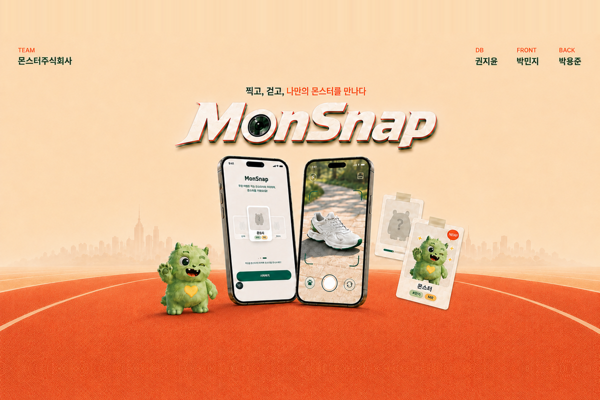
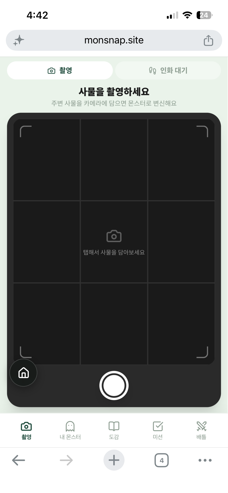
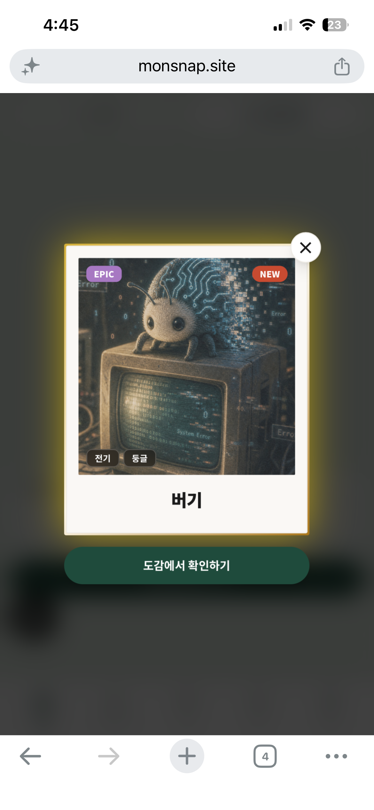
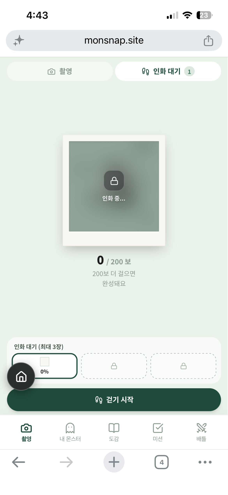
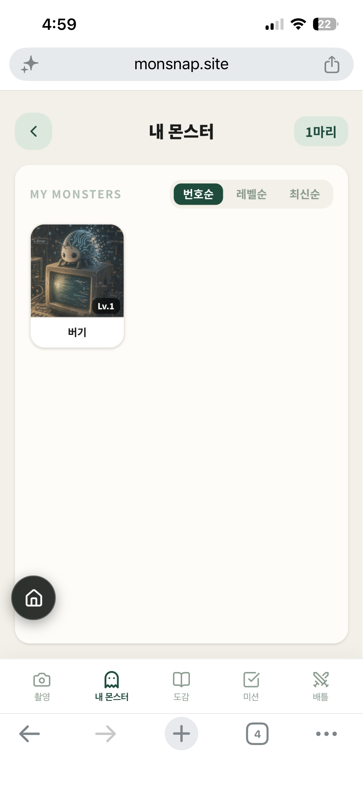
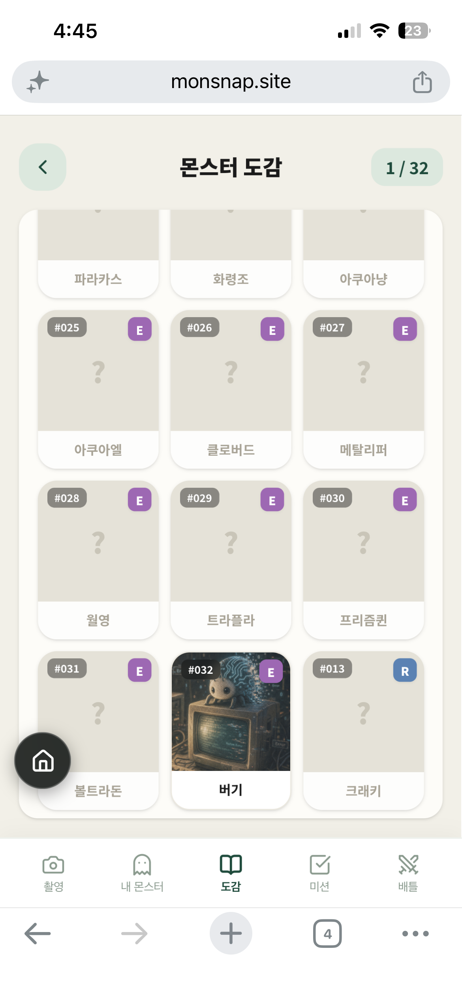
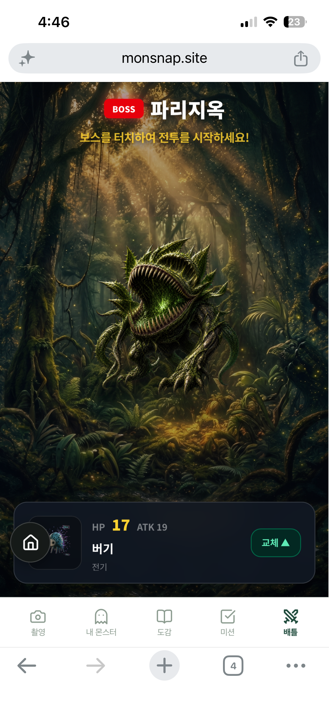
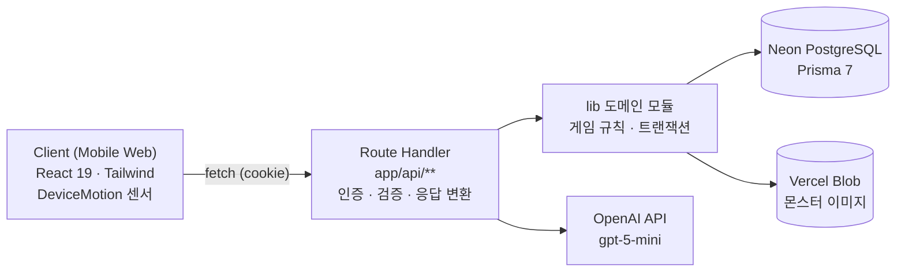

<div align="center">



# MonSnap

사진을 찍고, 걸어서 인화하는 몬스터 수집 웹 게임

지루한 건강관리를 수집과 성취의 즐거움으로 전환하는 게이미피케이션 웰니스 서비스입니다.

[](https://www.monsnap.site)
[](https://github.com/monster-corp/monsnap)

2026.07.27 ~ 2026.08.21 · 멋쟁이사자처럼 중앙 해커톤 · Status: MVP

</div>

<br/>

## 프로젝트 소개

위치 기반 수집형 게임은 특정 장소로 이동해야만 플레이할 수 있습니다. MonSnap은 위치 대신 '사물'을 게임 자원으로 삼습니다. 책상 위 머그컵, 가방 속 열쇠, 길가의 표지판 — 눈에 보이는 아무 사물이나
찍으면 그 사물에 대응하는 몬스터가 나옵니다.

일상적인 사물 촬영과 실제 걷기를 하나의 게임 루프로 연결해, 별도의 이동 목적지 없이도 수집과 운동을 동시에 경험할 수 있는 모바일 웹 게임을 구현합니다.

사물을 촬영해 몬스터를 발견하고, 획득한 알을 걷기로 부화한 뒤 수집한 몬스터로 보스전에 도전할 수 있습니다.

<br/>

## Game Loop

```
촬영  →  AI 판정  →  몬스터 획득  →  걷기  →  몬스터 확인  →  수집  →  보스전
```

주변 사물을 촬영하면 AI가 재질과 형태를 판정해 그에 맞는 몬스터 알을 줍니다. 알은 **실제로 걸어야** 부화하고, 부화한 몬스터는 도감에 등록되어 보스전에 출전합니다.

<br/>

## 주요 화면

|             촬영              |                  몬스터 획득                   |                인화 대기                 |
|:-----------------------------:|:----------------------------------------------:|:----------------------------------------:|
|  |  |  |

|                내 몬스터                 |                도감                 |             보스전              |
|:----------------------------------------:|:-----------------------------------:|:-------------------------------:|
|  |  |  |

<br/>

## 주요 기능

<details>
<summary><strong>사물 인식 기반 몬스터 매칭</strong></summary>
<br/>

AI가 재질 9종과 형태 5종을 판정해 그에 맞는 몬스터를 가중치 추첨으로 선택합니다. 확신도가 낮거나 해당 조합에 등록된 몬스터가 없으면 폴백 몬스터가 배정됩니다. 얼굴·신체 또는 화면 재촬영은 차단되며, 연속
차단 초기에는 충전을 소모하지 않습니다.

매칭 규칙·차단 조건·폴백 기준 → [게임 시스템 문서](docs/game-system.md#1-scan--matching)

</details>

<details>
<summary><strong>걸음 수 기반 부화</strong></summary>
<br/>

알마다 희귀도별 요구 걸음 수가 있습니다. 가속도 센서로 걸음을 세고 세션 단위로 서버에 동기화하며, 유저당 활성 세션은 1개로 제한됩니다.

세션 규칙·자동 만료·동시성 보장 → [게임 시스템 문서](docs/game-system.md#4-walk-session)

</details>

<details>
<summary><strong>개체값(IV) 제안</strong></summary>
<br/>

부화 시 스탯별로 개체값이 랜덤 생성됩니다. 이미 보유한 몬스터를 다시 부화시키면 새 개체값이 즉시 반영되지 않고 **제안 상태로 대기**합니다. 서버가 총합으로 걸러내지 않으므로 유저가 채택 여부를 직접
결정합니다.

IV 범위·최종 스탯 공식 → [게임 시스템 문서](docs/game-system.md#5-hatch--iv)

</details>

<details>
<summary><strong>보스전</strong></summary>
<br/>

제한시간 안에 터치로 데미지를 넣습니다. 보스의 약점 속성과 일치하는 재질이면 데미지가 증가하고, 강점 속성이면 감소합니다. 전투 결과는 클라이언트가 보고하되 서버가 경과 시간·터치 횟수·크리티컬 수를 검증합니다.

데미지 공식·검증 로직 → [게임 시스템 문서](docs/game-system.md#6-boss-battle)

</details>

<details>
<summary><strong>미션 · 자원 관리</strong></summary>
<br/>

일일/주간 미션이 KST 05:00 기준으로 리셋됩니다. 스캔 충전은 최대 5회까지 보유하며 3시간마다 1회 회복되고, 알 슬롯은 동시에 3개까지 사용할 수 있습니다.

충전 공식·미션 조건 타입 → [게임 시스템 문서](docs/game-system.md)

</details>

<br/>

## 기술 스택

**Environment**

  

**Frontend**

   

**Backend**

   

**AI / Infra**

   

<br/>

## 지원 환경

모바일 브라우저 기준으로 개발했습니다. 걷기 기능은 DeviceMotion 가속도 센서를 사용하므로 **HTTPS 환경의 모바일 실기기**가 필요하며, iOS는 별도의 센서 권한 승인 절차를 거칩니다. 데스크톱에서는
걷기를 제외한 기능만 확인할 수 있습니다.

<br/>

## 시작하기

### 요구 사항

Node.js 24 권장 · PostgreSQL (Neon 권장) · OpenAI API Key

### 설치 및 실행

```bash
# 1. 클론 및 패키지 설치
git clone https://github.com/monster-corp/monsnap.git
cd monsnap && npm install

# 2. 환경 변수 설정 (.env)
#    DATABASE_URL    - 런타임용 pooled connection
#    DIRECT_URL      - 마이그레이션 / 시드용 direct connection
#    OPENAI_API_KEY  - VLM 호출용

# 3. DB 마이그레이션 및 시딩
npx prisma migrate dev
npx prisma db seed

# 4. 개발 서버 실행
npm run dev
```

http://localhost:3000 에서 확인할 수 있습니다.

> 시드 스크립트는 기존 데이터를 **모두 삭제한 뒤** 재삽입합니다. 운영 DB에 실행하지 마세요.
> `.env`는 저장소에 커밋하지 않습니다.

### 스크립트

| 명령            | 설명                             |
|-----------------|----------------------------------|
| `npm run dev`   | 개발 서버                        |
| `npm run build` | prisma generate 후 프로덕션 빌드 |
| `npm start`     | 프로덕션 서버                    |
| `npm run lint`  | ESLint 검사                      |

<br/>

## 프로젝트 구조

```
monsnap
├── app
│   ├── (main)          # 홈 · 촬영 · 도감 · 미션 · 보스전 화면
│   ├── api             # Route Handlers
│   └── generated       # Prisma Client 생성 결과
├── components          # BottomNav, HomeButton
├── lib                 # 도메인 모듈 (스캔 · 알 · 걷기 · 전투 · 미션)
├── prisma              # schema · migrations · seed
└── docs                # 설계 문서
```

<br/>

## 아키텍처 요약



Route Handler는 인증·입력 검증·응답 변환을 담당하고, 게임 규칙과 트랜잭션 처리는 lib의 도메인 모듈에서 담당합니다. 동시성 제어 (슬롯 제한, 세션 상태 전이 등)는 DB 트랜잭션과 row lock,
조건부 상태 변경 등을 조합해 처리합니다.

> 계층 책임·인증·동시성 제어 상세 → [아키텍처 문서](docs/architecture.md)

<br/>

## API 요약

인증은 익명 세션 방식입니다. 닉네임을 생성하면 anon_token HttpOnly 쿠키가 발급됩니다.

| 메서드     | 경로                                              | 설명                                 |
|------------|---------------------------------------------------|--------------------------------------|
| POST / GET | `/api/users`                                      | 유저 생성 및 쿠키 발급 / 프로필 조회 |
| POST       | `/api/scans`                                      | 이미지 업로드 → AI 판정 → 알 생성    |
| GET        | `/api/scans/charge`                               | 스캔 충전 상태                       |
| GET        | `/api/eggs`                                       | 보유 중인 알 목록                    |
| POST       | `/api/eggs/{eggId}/walk-sessions`                 | 걷기 세션 시작                       |
| PATCH      | `/api/eggs/{eggId}/walk-sessions/{sessionId}`     | 걸음 수 동기화                       |
| POST       | `/api/eggs/{eggId}/walk-sessions/{sessionId}/end` | 걷기 세션 종료                       |
| POST       | `/api/eggs/{eggId}/hatch`                         | 인화(부화)                           |
| GET        | `/api/monsters`                                   | 도감 조회                            |
| GET        | `/api/user-monsters`                              | 보유 몬스터 목록                     |
| POST       | `/api/user-monsters/{id}/iv`                      | 대기 중인 개체값 채택 / 거부         |
| GET / POST | `/api/bosses/{dexId}`                             | 보스 정보 / 전투 결과 제출           |
| GET        | `/api/missions`                                   | 미션 진행도                          |

응답 형식: `{ code, message, data }` — code의 앞 세 자리가 HTTP 상태 코드입니다.

> 요청/응답 상세·전체 에러 코드 → [API 문서](docs/api.md)

<br/>

## 개발 컨벤션

- 기본 브랜치는 develop이며 `feature/*`, `fix/*`, `refactor/*` 와 kebab-case로 브랜치를 생성합니다
- 커밋 메시지는 `feat:`, `fix:`, `refactor:`, `chore:` 접두사를 사용합니다
- PR 규칙은 [PR 템플릿](.github/PULL_REQUEST_TEMPLATE.md) 참고

<br/>

## 팀 소개

| 이름   | GitHub                                           | 주요 기여                                                                                      |
|--------|--------------------------------------------------|------------------------------------------------------------------------------------------------|
| 권지윤 | [@kjyoon071025](https://github.com/kjyoon071025) | **Backend / Game Content**<br/>보스전 API 및 전투 검증, 몬스터 리소스, 시드 데이터             |
| 박민지 | [@pmj2744](https://github.com/pmj2744)           | **Frontend**<br/>모바일 UI, 촬영 플로우, DeviceMotion 센서 연동, 공통 네비게이션               |
| 박용준 | [@uptime-zero](https://github.com/uptime-zero)   | **Backend / Architecture**<br/>스캔 · 알 · 걷기 도메인, 공통 응답 규격, DB 스키마, 동시성 제어 |

<br/>

## 관련 문서

| 문서                               | 내용                                                                  |
|------------------------------------|-----------------------------------------------------------------------|
| [게임 시스템](docs/game-system.md) | 매칭 규칙, 충전 공식, 걷기 세션, IV·스탯 계산, 보스전 검증, 미션 조건 |
| [아키텍처](docs/architecture.md)   | 계층 책임, 인증, DB 구성, 동시성 제어, 에러 처리                      |
| [API](docs/api.md)                 | 전체 엔드포인트 요청/응답, 에러 코드 목록                             |