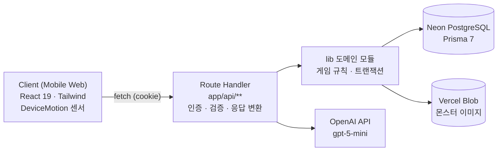

# 아키텍처 문서

## 목차

1. [Overview](#1-overview)
2. [계층 책임](#2-계층-책임)
3. [인증](#3-인증)
4. [DB 구성](#4-db-구성)
5. [트랜잭션 & 동시성 제어](#5-트랜잭션--동시성-제어)
6. [API 에러 처리](#6-api-에러-처리)
7. [이미지 저장](#7-이미지-저장)
8. [AI 연동](#8-ai-연동)
9. [배포](#9-배포)

---

## 1. Overview



---

## 2. 계층 책임

### Route Handler (`app/api/**/route.ts`)

- 인증 (`getCurrentUserId`) → 입력 파싱 → Zod 검증 → `lib/` 호출 → 응답 변환
- 게임 규칙, DB 접근, 트랜잭션을 직접 처리하지 않음

**예시: 부화 (hatch)**

```ts
// app/api/eggs/[eggId]/hatch/route.ts
const userId = await getCurrentUserId();          // 인증
const parsedEggId = parseBigIntParam(eggId);      // 입력 파싱
const result = await hatchEgg(userId, parsedEggId); // lib 위임
return respondWithStatus("OK", result);            // 응답 변환
```

**예시: 걸음 동기화 (PATCH walk-session)**

```ts
// app/api/eggs/[eggId]/walk-sessions/[sessionId]/route.ts
const parsed = patchSchema.safeParse(body);       // Zod 검증
const result = await applyStepsToWalkSession(...); // lib 위임 (Serializable 트랜잭션 포함)
return respondWithStatus("OK", result);
```

### 도메인 모듈 (`lib/`)

| 파일                   | 책임                                 |
|------------------------|--------------------------------------|
| `lib/scans.ts`         | 스캔 생성, 충전 차감, 차단 유예 판정 |
| `lib/eggs.ts`          | 알 생성, 슬롯 체크, 부화             |
| `lib/walk-sessions.ts` | 세션 생성·걸음 동기화·종료·자동 만료 |
| `lib/bosses.ts`        | 보스 조회, 전투 검증, 결과 저장      |
| `lib/missions.ts`      | 미션 진행도 계산                     |
| `lib/matching.ts`      | AI 결과 → 몬스터 매칭                |
| `lib/stats.ts`         | IV 생성, 최종 스탯 계산              |
| `lib/scan-charge.ts`   | 충전 리필, 시간당 차단 상한          |

---

## 3. 인증

- **방식**: 익명 토큰 — 닉네임 생성 시 `anon_token`(UUID v4) 발급
- **쿠키**: `httpOnly`, `secure`(프로덕션), `sameSite: lax`, `maxAge: 1년`
- **DB 조회**: `User.anonToken`(unique) 컬럼으로 직접 조회 — 별도 세션 테이블 없음, JWT 아님

```ts
// lib/auth.ts
const user = await prisma.user.findUnique({where: {anonToken}});
```

---

## 4. DB 구성

| 항목                 | 내용                                  |
|----------------------|---------------------------------------|
| DB                   | Neon PostgreSQL (serverless)          |
| ORM                  | Prisma 7                              |
| 클라이언트 출력 경로 | `app/generated/prisma` (기본값 아님)  |
| `DATABASE_URL`       | 런타임용 Neon pooled connection       |
| `DIRECT_URL`         | 마이그레이션·시드용 direct connection |

> `prisma.config.ts`에서 `DATABASE_URL`과 `DIRECT_URL`을 분리 설정하여 serverless 환경에서 마이그레이션이 direct connection을 사용하도록 강제함.

---

## 5. 트랜잭션 & 동시성 제어

| 보호 대상                  | 파일:함수                                   | 메커니즘                                           |
|----------------------------|---------------------------------------------|----------------------------------------------------|
| 유저당 활성 걷기 세션 1개  | `walk-sessions.ts: createWalkSession`       | DB partial unique index + 앱 체크 + `P2002` 캐치   |
| 걸음 수 동기화             | `walk-sessions.ts: applyStepsToWalkSession` | Serializable 트랜잭션                              |
| 방치 세션 자동 종료        | `walk-sessions.ts: expireStaleSession`      | 조건부 `updateMany`                                |
| 알 슬롯 3개 제한           | `eggs.ts: createEggFromScan`                | 유저 행 `FOR UPDATE`                               |
| 중복 부화 방지             | `eggs.ts: hatchEgg`                         | `FOR UPDATE` + 조건부 `updateMany`(count=0 → 에러) |
| IV accept/reject 동시 요청 | `user-monsters.ts: resolvePendingIv`        | `FOR UPDATE` + 재조회                              |
| 스캔 충전 차감             | `scans.ts: createScanAndSettleCharge`       | 유저 행 `FOR UPDATE` + 조건부 `updateMany`         |

> **알려진 제약**: 보스전 결과 저장 (`bosses.ts: processBossBattle`)은 트랜잭션·락·멱등성 보호가 없음. 동일 결과를 재제출하면 `BattleLog`가 중복 생성됨.

---

## 6. API 에러 처리

`ERROR` 상수 테이블, `ApiError` 클래스, `statusFromCode`, `ErrorKey`가 `lib/api/error-codes.ts`로 분리되어 있으며 `next/server`에 의존하지 않는
순수 모듈이다.

`lib/api/response.ts`는 `respondWithStatus` 함수만 갖는 얇은 파일로, 최상단에서 `next/server`를 import하고 `export * from "./error-codes"`로
기존 임포트 경로 (`from "@/lib/api/response"`)를 그대로 유지한다.

```ts
// lib/api/error-codes.ts — next/server 비의존
export const ERROR = { /* code, message 테이블 */} as const;
export type ErrorKey = keyof typeof ERROR;

export function statusFromCode(code: number): number { /* ... */
}

export class ApiError extends Error { /* key, code 보관 */
}

// lib/api/response.ts — next/server 의존, error-codes 재수출
import {NextResponse} from "next/server";
import {ERROR, statusFromCode, type ErrorKey} from "./error-codes";

export function respondWithStatus<T>(key: ErrorKey, data: T | null = null, overrideMessage?: string) {
    const {code, message} = ERROR[key];
    return NextResponse.json({code, message: overrideMessage ?? message, data}, {status: statusFromCode(code)});
}

export * from "./error-codes";
```

모든 Route Handler는 동일한 패턴을 따름:

```ts
try {
    // ...
} catch (err) {
    if (err instanceof ApiError) {
        return respondWithStatus(err.key, null, err.message);
    }
    console.error("[엔드포인트] unexpected error:", err);
    return respondWithStatus("INTERNAL_ERROR");
}
```

> **각주**: 분리 이전에는 `lib/api/response.ts` 한 파일에 위 요소가 모두 있어 최상단의 `next/server` import가 클라이언트 컴포넌트 번들에 섞여 들어가는 문제가 있었음.
> `error-codes.ts` 분리로 해결됨. Route Handler 쪽 import 경로 (`from "@/lib/api/response"`)는 재수출 덕분에 변경 없이 그대로 동작한다.

---

## 7. 이미지 저장

| 자산             | 저장 방식                                                            |
|------------------|----------------------------------------------------------------------|
| 몬스터·보스 아트 | Vercel Blob에 사전 업로드된 정적 자산 (시드 스크립트에 URL 하드코딩) |
| 유저 스캔 사진   | 저장하지 않음 — VLM 호출 후 즉시 폐기                                |

---

## 8. AI 연동

| 항목     | 내용                                                             |
|----------|------------------------------------------------------------------|
| 모델     | `gpt-5-mini`                                                     |
| SDK      | Vercel AI SDK                                                    |
| 타임아웃 | 15초                                                             |
| 출력     | 구조화 출력 스키마 `{material, shape, confidence, block_reason}` |
| 검증     | Zod로 응답 재검증 (`lib/schemas/vlm.ts: vlmResponseSchema`)      |

---

## 9. 배포

애플리케이션은 Vercel에 배포되어 있으며, Neon PostgreSQL과 Vercel Blob, OpenAI API를 외부 서비스로 사용한다.

저장소에는 `vercel.json`이나 별도의 CI/CD 워크플로 파일이 존재하지 않으므로, 저장소 기준으로는 상세한 배포 파이프라인 설정을 문서화하지 않는다.

| 구분              | 내용                                                  |
|-------------------|-------------------------------------------------------|
| 애플리케이션 배포 | Vercel                                                |
| DB                | Neon PostgreSQL                                       |
| 이미지 스토리지   | Vercel Blob                                           |
| AI                | OpenAI API                                            |
| CI/CD             | Vercel 배포 시스템 사용, 저장소 내 별도 워크플로 없음 |